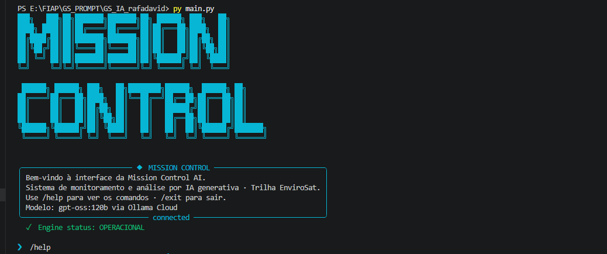
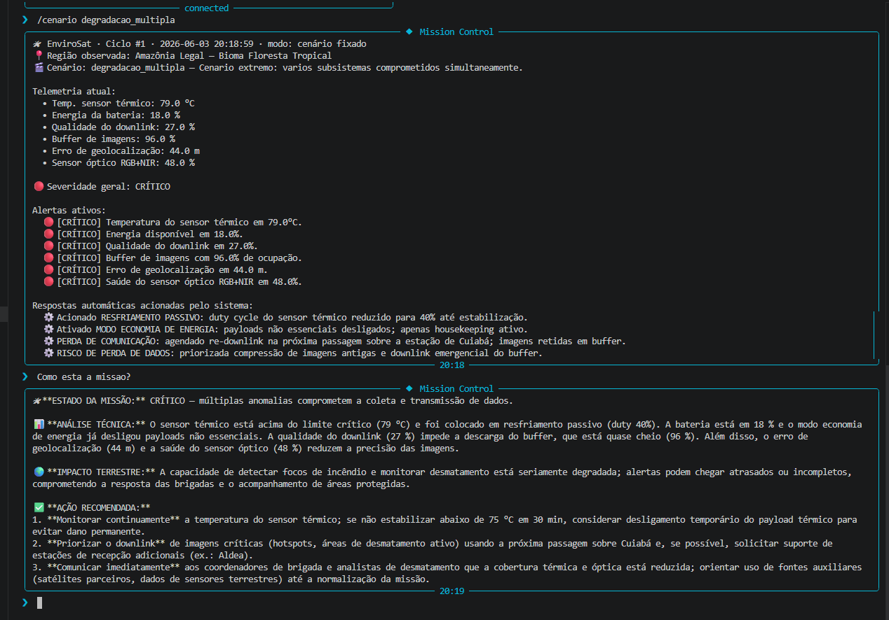

# 🚀 Mission Control AI — EnviroSat

Sistema de monitoramento operacional de um satélite ambiental simulado, com
análise de telemetria em linguagem natural via IA generativa (Ollama Cloud).
**Global Solution 2026.1 · FIAP · Ciência da Computação · Prompt Engineering and AI.**

> Trilha escolhida: **🌳 EnviroSat (Observação Ambiental)**

---

## 👥 Integrantes

- Rafael Marinucci Peres — RM: 569729 — Turma: 1CCR
- David dos Reis Cardoso — RM: 568938 — Turma: 1CCR 

**Modalidade:** Dupla

---

## 🛰 O que o projeto faz

O **Mission Control AI** simula a operação do **EnviroSat**, um satélite de
observação ambiental (sensor térmico + óptico RGB+NIR, órbita baixa, inspirado no
Amazônia-1 / Landsat) dedicado ao monitoramento da Amazônia Legal. O sistema:

1. **Gera telemetria simulada** em série temporal (6 parâmetros: temperatura do
   sensor térmico, energia, qualidade do downlink, buffer de imagens, erro de
   geolocalização e saúde do sensor óptico).
2. **Avalia alertas e toma decisões em Python** (thresholds + respostas
   automáticas como modo economia de energia e re-downlink emergencial).
3. **Integra IA generativa** (gpt-oss:120b via Ollama Cloud): os dados reais da
   telemetria são injetados dinamicamente no prompt, e a IA explica o estado da
   missão **sempre amarrando a análise técnica ao impacto ambiental terrestre**.

A interface é uma **CLI estilo Claude Code** (banner ASCII, painéis Rich, input
editável com prompt-toolkit).

---

## 🎭 Persona atendida

**Operador de centro de controle ambiental (INPE / órgão estadual) e coordenador
de brigada de combate a incêndio.** São profissionais que precisam de decisões
rápidas e claras a partir de telemetria bruta — não de jargão de engenharia
aeroespacial. O system prompt instrui a IA a falar a língua de quem combate o
fogo e o desmatamento na ponta.

---

## 🧰 Tecnologias utilizadas

- **Python 3.10+** (comentários em português brasileiro)
- **Ollama Cloud API** — modelo `gpt-oss:120b`
- Bibliotecas: `ollama`, `python-dotenv`, `rich`, `prompt-toolkit`, `pyfiglet`

---

## ▶️ Como executar

1. **Clone o repositório**
   ```bash
   git clone https://github.com/usuario/mission-control-ai.git
   cd mission-control-ai
   ```
2. **Crie o ambiente virtual**
   ```bash
   python -m venv .venv
   # Windows (PowerShell):
   .venv\Scripts\Activate.ps1
   # Linux/Mac:
   source .venv/bin/activate
   ```
3. **Instale as dependências**
   ```bash
   pip install -r requirements.txt
   ```
4. **Crie o arquivo `.env`** na raiz (copie de `.env.example`) com a sua chave da
   Ollama Cloud (gere gratuitamente em https://ollama.com):
   ```env
   OLLAMA_API_KEY=sua_chave_aqui
   ```
5. **Execute**
   ```bash
   python main.py
   ```

Comandos da CLI: `/help` · `/status` · `/cenario <nome>` · `/about` · `/clear` ·
`/exit`. Qualquer outro texto é enviado para a análise da IA (ex.: *"Como está a
missão?"*).

Para demonstrar um **alerta** de forma determinística, fixe um cenário crítico e
depois pergunte à IA:

```
❯ /cenario degradacao_multipla     # fixa o cenário (lista todos com /cenario)
❯ Como está a missão?              # a IA responde com o alerta + análise
❯ /cenario off                     # volta ao modo dinâmico
```

Banner standalone: `python banner_ascii.py` (use `--fonts`, `--demo`,
`--font <nome> --text "<texto>"`).

---

## 🖼 Demonstração




> Capture estes prints rodando `python main.py` (banner inicial) e fazendo uma
> pergunta em um cenário de alerta.

---

## 🧠 System Prompt

O system prompt completo está em [`prompts/system_prompt.md`](prompts/system_prompt.md).
Ele define **papel + escopo + restrições + tom + formato de saída** e inclui um
exemplo *few-shot*. Pontos centrais:

- A severidade dos alertas é decidida em **Python** (`src/alertas.py`); a IA
  respeita essa classificação e não a altera.
- A IA é obrigada a responder em formato fixo (Estado da missão / Análise técnica
  / **Impacto terrestre** / Ação recomendada).
- Toda resposta amarra a anomalia orbital ao impacto no combate ao desmatamento
  e a incêndios.

---

## 🧪 Cenários de teste demonstrados

Cenários determinísticos disponíveis em [`data/cenarios.json`](data/cenarios.json):

1. **operacao_normal** — todos os parâmetros dentro do range.
2. **foco_incendio_sensor_quente** — sensor térmico em sobreaquecimento (alerta +
   resposta automática de resfriamento).
3. **bateria_critica** — energia < 20% → ativa **modo economia** automaticamente.
4. **perda_comunicacao** — downlink degradado + buffer cheio → re-downlink
   emergencial.
5. **degradacao_multipla** — cenário extremo com vários subsistemas comprometidos.

---

## 💼 Proposta de valor / modelo de negócio

**1. Qual o problema real terrestre que esta missão resolve?**
O desmatamento e os incêndios florestais na Amazônia destroem biodiversidade,
emitem CO₂ e ameaçam comunidades. A detecção precoce de focos de calor e de novos
desmates depende de satélites operando de forma saudável — quando o payload falha,
a fiscalização e as brigadas ficam "cegas" justamente nas janelas mais críticas.

**2. Quem paga pela solução?**
Modelo **híbrido**. Setor público é o pagador principal — INPE, IBAMA, ICMBio e
órgãos estaduais de meio ambiente, que dependem de dados orbitais para autuações
e despacho de brigadas. Complementarmente, o setor privado: empresas com metas
ESG, certificadoras de crédito de carbono e seguradoras agrícolas que precisam
comprovar integridade ambiental de áreas.

**3. Métrica de impacto (se o satélite operar 100% saudável por 1 ano):**
Cobertura confiável de detecção de focos sobre **~5 milhões de km² da Amazônia
Legal**, com potencial de antecipar o despacho de brigadas em focos que, contidos
cedo, evitam a emissão de uma ordem de grandeza de **centenas de milhares de
toneladas de CO₂** por temporada de seca e protegem milhares de hectares de mata.

**4. Modelo de negócio:**
**Dado-como-serviço (DaaS)** com camada de IA: assinatura institucional que
entrega não só a imagem bruta, mas alertas já interpretados e priorizados ("onde
agir agora"). Para o setor público, pode operar como **concessão/serviço público**
de monitoramento ambiental contínuo.

---

## ⚠️ Limitações conhecidas

- A telemetria é **simulada** (random walk + cenários), não vem de um satélite real.
- A geração de dados é plausível, mas **não cientificamente validada**.
- As respostas da IA são **não-determinísticas**; em situações idênticas o texto
  pode variar (mitigado com `temperature=0.3` e formato de saída fixo).
- Não há persistência em disco do histórico entre execuções (memória só na sessão).
- Requer conexão com a internet e uma chave válida da Ollama Cloud.

---

## 🎬 Vídeo de demonstração

🔗 [Assistir demonstração no YouTube](https://youtu.be/UBo3r2MboXY)

> Configurado como "Não listado" no YouTube.
